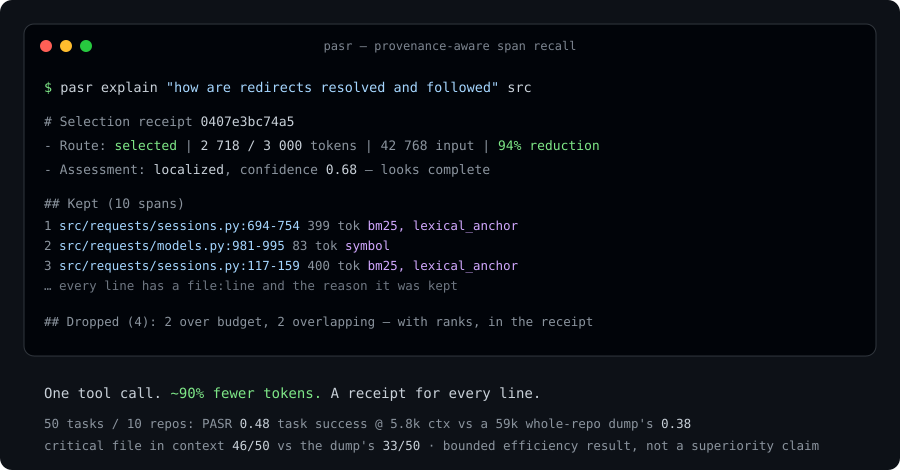

# PASR

**Provenance-Aware Span Recall** — a zero-setup context-broker MCP for coding and
document agents. It passes your agent exactly the context it needs, with a receipt.

[](https://pypi.org/project/pasr-mcp/)
[](https://pypi.org/project/pasr-mcp/)
[](https://github.com/Apheironn/pasr/actions/workflows/ci.yml)
[](LICENSE)

PASR sits between a large workspace (a repo, or long documents) and the model. Instead
of letting the agent read whole files and burn tokens, it hands back a **small,
budgeted, fully-traceable slice**: every returned span carries its `file:line`, token
count, and the reason it was selected — and PASR tells the agent when it is the wrong
tool for the question.

> **v0.2.0.** Offline retrieval (BM25 + lexical + tree-sitter symbols + an optional
> sub-word semantic scorer) under a hard token budget; four MCP tools over stdio
> (`select_context` — with an optional symbol-index header and a folded dependency
> closure —, `trace_dependencies` — forward or reverse/impact —, `explain_selection`,
> `expand_context`); byte-stable receipts + a "tokens saved" usage ledger; query
> self-assessment + routing advice; committable Context Packs; a `pasr` CLI with
> `explain` / `trace` / `pack` / `review` / `context` / `report`; a headless
> `pasr context` GitHub Action.

<p align="center"></p>

## Before / after

One localized question — *"how are redirects resolved and followed"* — against
`psf/requests` ([verbatim transcript](examples/01-requests-redirects.md)):

| | agent reads the `src/` tree | **`select_context`** |
|---|---:|---:|
| input tokens | 42 768 | **2 718** (94% less) |
| tool round trips | 1 big read | **1** |
| provenance | none | **`file:line` + reason for all 10 spans** |
| wrong-tool signal | — | **`localized`, confidence 0.68, "looks complete"** |

Across a **50-task, 10-repo evaluation** (a real model answering from only what each
arm supplies, a second model judging): `select_context` **0.48** task success at
**5.8k** context tokens vs a **59k-token whole-repo dump's 0.38** — `pasr` **+0.10** on
paired success (`pasr_fallback` +0.12), both clearing the -0.05 non-inferiority margin
on the point estimate; the 95% CI still crosses it. PASR gets the answer's file into
context **46/50** vs the dump's **33/50**. An agent's own grep + read-6-files scores
0.52 but at **4× the tokens, 6 round trips, 30% critical miss**. A **bounded efficiency
result**, not a superiority claim — full detail and the supporting runs:
[`eval/RESULTS.md`](eval/RESULTS.md), write-up: [`docs/blog/what-worked.md`](docs/blog/what-worked.md).

## What it is / is not

| It is | It is not |
|---|---|
| A local program your agent calls as an MCP tool | A model, an IDE, or a chatbot |
| A retrieval + token-budget + audit layer | A "solve long-context / lost-in-the-middle" claim |
| Deterministic, inspectable, offline by default | A hosted service or a vector-DB signup |
| Good at *locating* evidence and *tracing* dependencies | A repo-wide code-completion engine |

## Honest capability boundary (from the research)

- **Strong:** deterministic dependency / variable-trace closure — large token cuts,
  quality preserved or improved.
- **Bounded positive:** localized document/code QA — meaningfully fewer model input
  tokens and lower latency at parity quality.
- **Do not claim:** global aggregation, repo-wide code completion, lexical-mismatch
  position robustness.

## Run it

With [`uv`](https://docs.astral.sh/uv/) (recommended — `uvx` fetches and runs it, no
install):

```json
{
  "mcpServers": {
    "pasr": { "command": "uvx", "args": ["pasr-mcp", "--workspace", "."] }
  }
}
```

Or `pip install pasr-mcp` and point the client at `pasr-mcp --workspace .`.

Per-client setup: [Claude Code](docs/install/claude-code.md) ·
[Cursor](docs/install/cursor.md) · [Windsurf](docs/install/windsurf.md).

See [`examples/`](examples/README.md) for five verbatim runs against pinned public
repos (requests, httpx, attrs, packaging, starlette).

## MCP tools

| Tool | Purpose |
|---|---|
| `select_context` | budgeted, provenance-tracked slice for a query (+ `map_tokens`, `trace=`, Context Packs) |
| `trace_dependencies` | deterministic def/reference closure for a symbol (Python, JS/TS); `direction="callers"` reverses it for impact analysis |
| `explain_selection` | return the stored receipt for a prior selection |
| `expand_context` | re-run a prior selection once with a larger budget |

Every `select_context` result also carries a `query_class`, a `confidence` score, and
`advice` — e.g. "aggregation-style question: read the files directly" or "low coverage,
also grep for X or call `expand_context`".

`select_context(map_tokens=N)` prepends a query-ranked `file:line kind name` symbol
index of up to `N` tokens (carved out of `budget_tokens`, never additive) — repo-map
style pointer coverage of the whole file set *without* dropping the bodies in the slice.
In the offline bake-off this lifts retrieval quality to a full repo-map's level at
perfect critical-file coverage; see [`docs/competitors-benchmark.md`](docs/competitors-benchmark.md).

`select_context(trace="<symbol>")` folds that symbol's dependency closure into the same
slice (also carved from `budget_tokens`) — one call instead of a separate
`trace_dependencies` round trip for trace-style questions.

## CLI

```bash
pasr explain "how is the request rate limited"        # run a selection, print the receipt
pasr trace enforce_per_user_request_quota src/        # a symbol's dependency closure
pasr trace HTTPAdapter src/ --callers                 # who calls it (impact analysis)
pasr pack auth "session + login + token" src/auth/    # save a Context Pack
pasr review --staged src/                             # touched defs + the callers they affect
pasr context --issue "$(cat issue.txt)" src/ \        # headless slice for CI / agents
  --format text --metrics-file metrics.json
pasr report --price-per-mtok 3                        # tokens / round trips / $ saved so far
```

For CI there's a composite GitHub Action at `.github/actions/pasr-context/` — see
[`docs/ci.md`](docs/ci.md).

Receipts land in `.pasr/receipts/<id>.{json,md}` (gitignored) — a byte-stable record of
what PASR handed the model and what it dropped. A usage ledger accrues in
`.pasr/ledger.jsonl` (gitignored) — one row per real call; `pasr report` turns it into
"N fewer tokens across M calls, R round trips saved". Context Packs land in `.pasr/packs/`
(committable) — a named, warm-start slice the whole team can load with
`select_context(pack="auth")`.

## Docs

- [`examples/`](examples/README.md) — verbatim CLI transcripts against pinned repos
- [`eval/RESULTS.md`](eval/RESULTS.md) — the 50-task evaluation, pre-registered (`pip install ./eval` → `pasr-bench`)
- [`docs/competitors-benchmark.md`](docs/competitors-benchmark.md) — offline bake-off vs grep / repo-map / semantic-search
- [`docs/blog/what-worked.md`](docs/blog/what-worked.md) — what held up, what didn't
- [`docs/architecture.md`](docs/architecture.md) — architecture and data flow
- [`docs/roadmap.md`](docs/roadmap.md) — what's shipped and what's next
- [`CHANGELOG.md`](CHANGELOG.md) · [`CONTRIBUTING.md`](CONTRIBUTING.md)

The research this productises is the frozen `researchv2` study (model-external context
optimization; a comparative write-up is in preparation).

## Development

```bash
python -m venv .venv && . .venv/bin/activate   # or .venv\Scripts\Activate.ps1
pip install -e ".[dev]"
pytest -q
```

The pure-logic core imports **no** `torch` / `transformers` (and no `mcp` SDK — that
loads only under `pasr.mcp`):

```bash
python -c "import pasr.pipeline, sys; assert not {'torch','transformers'} & set(sys.modules)"
```

## License

[Apache-2.0](LICENSE).
