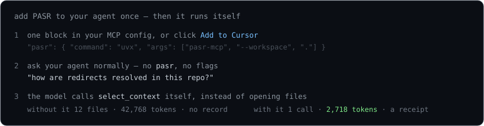

# PASR

**Provenance-Aware Span Recall** — a zero-setup context broker your coding agent calls
as an MCP tool. It hands the model the *few* lines that answer the question, each with a
`file:line` and the reason it was picked — and tells the agent when it asked the wrong
tool.

[](https://pypi.org/project/pasr-mcp/)
[](https://pypi.org/project/pasr-mcp/)
[](https://github.com/Apheironn/pasr/actions/workflows/ci.yml)
[](LICENSE)

<p align="center"></p>

## The problem

An agent working in a real repo has two bad options: read whole files and burn its
context window on code that never mattered, or grep-and-guess and miss the file that
held the answer. Either way, **you cannot see what it looked at** — no record, no line
numbers, no reason.

## What PASR does

- **Budgeted.** You set a token ceiling; PASR never returns more, and it packs whole
  spans — never a truncated function. If the full file set already fits, you get it
  back unchanged.
- **Traceable.** Every span carries `file:line`, a token count, its retrieval score,
  and *why* it was kept (`bm25`, `symbol`, `active_window`, …). A byte-stable receipt —
  of what was kept *and* what was dropped — lands on disk for every call.
- **Honest.** Each result is classified `localized` / `trace` / `aggregation`, with a
  confidence and advice (*"aggregation-style question — read the files directly"*).
  PASR tells the agent when it is the wrong tool.
- **Zero setup.** No daemon, no vector database, no index to build, offline by default.

## Install

[](docs/install/cursor.md)
[](https://insiders.vscode.dev/redirect/mcp/install?name=pasr&config=%7B%22command%22%3A%22uvx%22%2C%22args%22%3A%5B%22pasr-mcp%22%2C%22--workspace%22%2C%22.%22%5D%7D)

```bash
claude mcp add pasr -- uvx pasr-mcp --workspace .
```

Or paste this into your client's MCP config (Claude Desktop, Windsurf, Cline, Zed, …):

```json
{ "mcpServers": { "pasr": { "command": "uvx", "args": ["pasr-mcp", "--workspace", "."] } } }
```

After that you **never type `pasr`**. Ask your agent a question the normal way — *"how
does redirect handling work here?"*, *"what breaks if I change `HTTPAdapter`?"* — and the
model calls `select_context` / `trace_dependencies` itself instead of opening whole
files.

<p align="center"></p>

Per-client setup notes: [Claude Code](docs/install/claude-code.md) ·
[Cursor](docs/install/cursor.md) · [Windsurf](docs/install/windsurf.md).

**Without an agent:** `pip install pasr-mcp`, then `pasr explain "<question>"` prints the
same receipt the MCP tool returns. Five verbatim runs against pinned public repos are in
[`examples/`](examples/README.md).

## In one call

One localized question — *"how are redirects resolved and followed"* — against
`psf/requests` ([verbatim transcript](examples/01-requests-redirects.md)):

| | agent reads the repo | **PASR `select_context`** |
|---|---:|---:|
| input tokens | 42 768 | **2 718** — 94% less |
| tool round trips | 1 large read | **1** |
| provenance | none | **`file:line` + reason for all 10 spans** |
| wrong-tool signal | — | **`localized`, confidence 0.68, "looks complete"** |

The selection itself runs **offline in ~0.3 s** on this repo — no API call, no index
build. (`pasr explain` prints `selected in N ms` to stderr; it is kept out of the
receipt, which stays wall-clock-free and byte-stable.)

## Why PASR, not the usual options

| | repo-map<br>(aider) | embedding search<br>(claude-context, Cody) | grep / ripgrep<br>MCP | **PASR** |
|---|:--:|:--:|:--:|:--:|
| Setup | none | embedder + vector DB + index build | none | **none** |
| Returns | signatures, **no bodies** | chunks, no reason | keyword hits | **bodies + `file:line` + reason + score** |
| Hard token budget | truncates | top-k, no cap | dumps everything | **never exceeded** |
| Deterministic | ~ | no (ANN + model drift) | yes | **yes — byte-identical** |
| Says "wrong tool for this" | no | no | no | **yes — routing + confidence** |
| Audit trail | no | no | no | **a receipt per call** |
| Dependency-closure trace | no | no | no | **forward + reverse (impact)** |

On the offline bake-off (50 tasks, 10 repos, 6k-token budget, no API, no GPU),
`select_context` **ties a full repo-map on "how does this work" questions (0.84) using
10× less text** — 5.7k tokens across 18 files vs the map's 46 files of signatures — and
with `map_tokens=1200` it matches repo-map overall (0.90) at **100% critical-file
coverage** while still carrying real code. Full table:
[`docs/competitors-benchmark.md`](docs/competitors-benchmark.md).

## Does the model actually answer better?

A **50-task, 10-repo evaluation** — a real model answering from only what each arm
supplies, a second model judging:

- `select_context` **0.48** task success at **5.8k** context tokens, vs a **59k-token
  whole-repo dump's 0.38** — **+0.10** on paired success (`pasr_fallback` +0.12).
- Both clear the −0.05 non-inferiority margin on the point estimate; the 95% CI still
  crosses it at n = 50.
- PASR gets the answer's file into context **46 / 50**, vs the dump's **33 / 50**.
- An agent's own grep + read-six-files scores 0.52 — but at **4× the tokens, 6 round
  trips, and a 30% critical-file miss**.

A **bounded efficiency result, not a superiority claim.** Pre-registered, with the
supporting runs: [`eval/RESULTS.md`](eval/RESULTS.md) · narrative:
[`docs/blog/what-worked.md`](docs/blog/what-worked.md).

## How it works

```
query + file globs
  → discover safe workspace files, tokenize, line-aligned chunks
  → lossless-under-budget check: does the whole thing already fit? return it
  → candidates:  BM25 (Okapi)  +  lexical-anchor coverage  +  tree-sitter symbols
                 +  optional sub-word / MiniLM semantic scorer
  → fuse by reciprocal-rank fusion            score(s) = Σ_r  1 / (k + rank_r(s)),  k = 60
  → reserve an active window (prefix + tail of the likely answer region)
  → hard-budget pack (knapsack):  maximise Σ score(s)   s.t.   Σ tokens(s) ≤ budget
  → classify the query, score confidence, write the receipt
  → return spans + provenance + token accounting + advice
```

RRF needs no score calibration across the rankers — only their rank orders — so BM25,
symbol hits, and the semantic scorer combine without tuning weights. The pack is whole
spans only, dependency-ordered.

## MCP tools

| Tool | Purpose |
|---|---|
| `select_context` | budgeted, provenance-tracked slice for a query — plus `map_tokens` (a query-ranked symbol-index header, carved *out* of the budget) and `trace=` (fold a symbol's dependency closure into the same slice) |
| `trace_dependencies` | deterministic def/reference closure for a symbol (Python, JS/TS); `direction="callers"` reverses it for impact analysis |
| `explain_selection` | return the stored receipt for a prior selection |
| `expand_context` | re-run a prior selection once with a larger budget |

## CLI

```bash
pasr explain "how is the request rate limited"        # run a selection, print the receipt
pasr trace enforce_per_user_request_quota src/        # a symbol's dependency closure
pasr trace HTTPAdapter src/ --callers                 # who calls it — impact analysis
pasr pack auth "session + login + token" src/auth/    # save a committable Context Pack
pasr review --staged src/                             # touched defs + the callers they affect
pasr context --issue "$(cat issue.txt)" src/ \        # headless slice for CI / agents
  --format text --metrics-file metrics.json
pasr report --price-per-mtok 3                        # tokens / round trips / $ saved so far
```

The path is optional everywhere — with none, PASR scans the whole workspace
(`.gitignore`-aware). Pass a directory or globs (`src/`, `lib/ "**/*.py"`) only to scope
it tighter or run faster.

Receipts land in `.pasr/receipts/<id>.{json,md}` (gitignored) — a byte-stable record of
what PASR handed the model and what it dropped. A usage ledger accrues in
`.pasr/ledger.jsonl`; `pasr report` turns it into *"N fewer tokens across M calls, R
round trips saved"*. Context Packs land in `.pasr/packs/` (committable) — a named,
warm-start slice the whole team loads with `select_context(pack="auth")`. For CI there
is a composite GitHub Action — see [`docs/ci.md`](docs/ci.md).

## Capability boundary (from the research)

- **Strong:** deterministic dependency / variable-trace closure — large token cuts,
  quality preserved or improved.
- **Bounded positive:** localized document / code QA — meaningfully fewer model input
  tokens and lower latency at parity quality.
- **Do not claim:** global aggregation, repo-wide code completion, lexical-mismatch
  position robustness. PASR classifies these and says so.

## Docs

- [`examples/`](examples/README.md) — five verbatim CLI transcripts against pinned repos
- [`eval/RESULTS.md`](eval/RESULTS.md) — the 50-task evaluation, pre-registered (`pip install ./eval` → `pasr-bench`)
- [`docs/competitors-benchmark.md`](docs/competitors-benchmark.md) — offline bake-off vs grep / repo-map / semantic search
- [`docs/architecture.md`](docs/architecture.md) — components and data flow
- [`docs/roadmap.md`](docs/roadmap.md) — shipped and next
- [`CHANGELOG.md`](CHANGELOG.md) · [`CONTRIBUTING.md`](CONTRIBUTING.md)

This productises the frozen `researchv2` study (model-external context optimization); a
comparative write-up is in preparation.

## Development

```bash
python -m venv .venv && . .venv/bin/activate   # or .venv\Scripts\Activate.ps1
pip install -e ".[dev]"
pytest -q
```

The pure-logic core imports **no** `torch` / `transformers` (and no `mcp` SDK — that
loads only under `pasr.mcp`):

```bash
python -c "import pasr.pipeline, sys; assert not {'torch','transformers'} & set(sys.modules)"
```

## License

[Apache-2.0](LICENSE).
