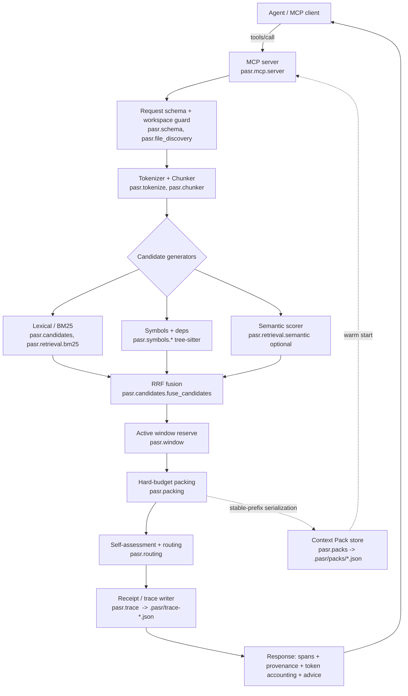

# PASR MCP — Architecture

PASR (Provenance-Aware Span Recall) is a **zero-setup context-broker MCP** for coding
and document agents. It sits between a large workspace (repo or long documents) and the
model, and hands the agent a **small, budgeted, fully-traceable slice** of that
workspace instead of letting the agent read whole files.

It is a productised extraction of the `researchv2` study. The research is frozen; this
repository is the product line ("Track 2" in `researchv2/docs/program_tracks.md`).

## What it is / is not

| It is | It is not |
|---|---|
| A local program an agent calls as an MCP tool | A model, an IDE, or a chatbot |
| A retrieval + token-budget + audit layer | A "solve long-context / lost-in-the-middle" claim |
| Deterministic, inspectable, offline by default | A hosted service or vector-DB signup |
| Good at *locating* evidence and *tracing* dependencies | A repo-wide code-completion engine (research showed quality loss there) |

## Honest capability boundary (from the research)

- **Strong:** deterministic dependency / variable-trace closure (~99% fewer tokens,
  quality preserved or improved on RULER-style tasks).
- **Positive, bounded:** localized document/code QA — ~30–50% fewer model input tokens
  and lower latency at parity quality on LongBench-Pro-style tasks.
- **Weak / do not claim:** global aggregation (BABILong), repo-wide code completion
  (RepoBench), lexical-mismatch position robustness (NoLiMa).

Positioning follows the boundary: **"help the agent find the right place and follow the
right chain,"** not "write the code for you."

## Target component architecture



## Data flow (one `select_context` call)

```text
query + file globs
  -> resolve safe workspace files              (file_discovery)
  -> tokenize + line-aligned chunking          (tokenize, chunker)  -> RawSpan[]
  -> LOSSLESS-UNDER-BUDGET check: full context fits budget? return it unchanged
  -> candidate generation (lexical/BM25 + symbols + optional semantic)
  -> RRF fusion -> single ranked CandidateSpan[]
  -> reserve active window (prefix + tail)
  -> hard-budget whole-span packing (score-only | coverage-aware)
  -> self-assessment: confidence + query-class (localized | trace | aggregation)
  -> write receipt (.pasr/trace-<id>.json) + human-readable summary
  -> return { spans[], provenance(file:line), token_accounting, routing_advice }
```

## Inherited modules (from `researchv2`, pure-logic, torch-free after extraction)

| Module | Responsibility | Extraction status |
|---|---|---|
| `evidence.py` | keyword extraction, claim/coverage accounting | copied verbatim |
| `candidates.py` | `CandidateSpan` type, lexical candidates, RRF fusion, stable ranking | copied; tokenizer calls delisted from torch |
| `packing.py` | hard-budget score-only / coverage-aware / active-window packing, dependency ordering | copied verbatim |
| `context_order.py` | span packaging orders (score/source/edge/diverse) | copied verbatim |
| `controller.py` | heuristic block-size / top-k choice | copied verbatim |
| `file_discovery.py` | safe workspace-relative file discovery | copied; `.gitignore` + languages added in M1 |
| `symbols/python_symbols.py` | Python AST symbol/dependency candidate windows | copied; generalised to tree-sitter in M5 |
| `_tokenize.py` | list-based encode/decode adapter | new shim seeding M1 |

## Replaced / not carried over

- `models/` (`compressed_memory`, `recall`, `context_selector`, `dynamic_window`,
  `model_loader`): all require a HF model just to produce the semantic signal. Replaced
  by a pluggable `SemanticScorer` (M10, optional) and a torch-free active-window
  calculator (M3). The windowing *math* in `dynamic_window.DynamicWindowController` is
  reused as plain integer offsets.
- `evaluation/`, `benchmarks/`, `notebooks/`, `paper/`: stay in `researchv2`.
- `demo/` Gradio app: optional later port as `pasr demo`.

## MCP tools (target surface)

| Tool | Purpose | Milestone |
|---|---|---|
| `select_context` | budgeted, traceable slice for a query | M4 |
| `trace_dependencies` | deterministic import/def/reference closure for a symbol | M5 |
| `expand_context` | one bounded widening pass when the slice was insufficient | M7 |
| `explain_selection` | return the receipt for a prior selection id | M6 |

## Design rules

1. Every candidate generator returns the same `CandidateSpan` record type.
2. Ranking and packing are separate operations.
3. The reader only ever sees **copied raw source text** — never scores, vectors, or
   generated summaries.
4. Token budget is a **hard contract**: the tool never returns more than `budget_tokens`.
5. **Lossless under budget:** if the full serialized context already fits the budget,
   return it unchanged and say so.
6. Deterministic: same repo + same query + same config => identical bytes out.
7. Offline by default: no network, no daemon, no vector DB. External services are
   strictly opt-in (`SemanticScorer` plugins).
8. Every response carries file+line provenance, token count, selection reason, and
   score components for every span, plus a routing self-assessment.
9. Each stage is independently testable and can be disabled for ablation.
