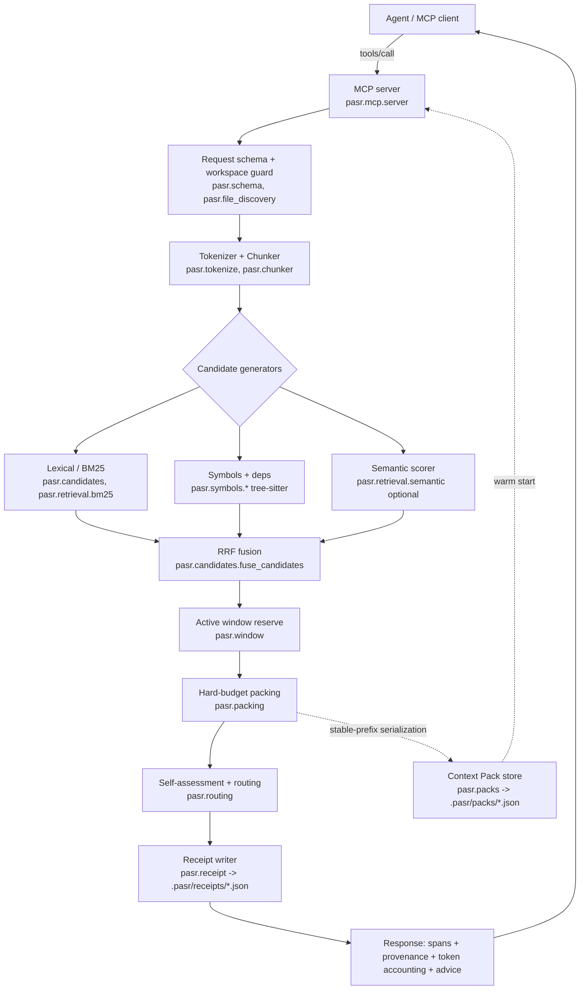

# PASR MCP — Architecture

PASR (Provenance-Aware Span Recall) is a **local, token-budgeted,
source-traceable context MCP server** for coding agents. It selects source within
a rendered-context budget alongside the agent's native search and read tools.
Computed spans are not guaranteed full functions or complete answer evidence.

It is a productised extraction of the `researchv2` study (model-external context
optimisation). That research is frozen; this repository is its product line.

The [first-principles audit](pipeline-audit-20260929.md) separates implemented
behavior from intended guarantees. Current agent-loop evidence does not establish
better answer accuracy or lower total tokens than native grep/read. Live selection
now budgets its rendered context; MCP envelopes, catalogs, and repeated conversation
history remain separate costs.

This document describes the current checkout targeting 0.3.0, not an already
published release. PyPI currently provides 0.2.1. To run this source, use
`uvx --from /absolute/path/to/pasr pasr-mcp --workspace /absolute/path/to/project`
with a current checkout and absolute paths.

## What it is / is not

| It is | It is not |
|---|---|
| A local program an agent calls as an MCP tool | A model, an IDE, or a chatbot |
| Retrieval, rendered-context budgeting, and best-effort selection receipts | A guarantee of complete evidence or lower total API bills |
| Deterministic for fixed source/configuration and independent requests | A complete global agent audit or atomic workspace snapshot |
| Lexical/structural navigation and bounded static name tracing | Full language-level dependency resolution |

## Evidence and capability boundary

The 2026-10-03 untouched confirmation supported 28/40 answers in both native and
experimental split arms, with 3 versus 7 material errors. Split used 25.3% fewer
cumulative provider tokens; the primary gate failed. Exploratory reuse of those
40 questions with GPT-6 Luna supported 26/40 native versus 32/40 split, with two
material errors each. Mean tokens were 12,430.875 native known subtotal versus
10,698.075 split; interrupted native usage is partly unknown. The combined gate
failed. See [current methods and caveats](competitors-benchmark.md#real-upstream-components-with-low-cost-openai-models--2026-10-03)
and [audit sections 23–24](pipeline-audit-20260929.md).

These studies do not establish universal quality/cost superiority. Actual Aider
RepoMap and Repomix components were evaluated, not the full Aider coding agent.
Earlier research datasets do not certify product-level quality parity. Global
aggregation, lexical mismatch, dynamic bindings, and cross-file mechanisms can
require additional reads; heuristic routing does not guarantee detection of gaps.

Local processing does not prevent the client sending returned source to a cloud
model. Default redaction is a no-op, not automatic secret detection. Receipt
persistence is best-effort and covers only PASR-delivered content. It is neither
an immutable source archive nor a record of everything the agent reads or does.

## Target component architecture


```mermaid
flowchart TD
    A[Agent / MCP client] -->|tools/call| S[MCP server<br/>pasr.mcp.server]
    S --> R[Request schema + workspace guard<br/>pasr.schema, pasr.file_discovery]
    R --> T[Tokenizer + Chunker<br/>pasr.tokenize, pasr.chunker]
    T --> CG{Candidate generators}
    CG --> L[Lexical / BM25<br/>pasr.candidates, pasr.retrieval.bm25]
    CG --> SY[Symbols + deps<br/>pasr.symbols.* tree-sitter]
    CG --> SE[Semantic scorer<br/>pasr.retrieval.semantic  optional]
    L --> F[RRF fusion<br/>pasr.candidates.fuse_candidates]
    SY --> F
    SE --> F
    F --> AW[Active window reserve<br/>pasr.window]
    AW --> P[Hard-budget packing<br/>pasr.packing]
    P --> SA[Self-assessment + routing<br/>pasr.routing]
    SA --> RC[Receipt writer<br/>pasr.receipt -> .pasr/receipts/*.json]
    RC --> O[Response: spans + provenance + token accounting + advice]
    O --> A
    P -.stable-prefix serialization.-> PK[Context Pack store<br/>pasr.packs -> .pasr/packs/*.json]
    PK -.warm start.-> S
```

## Data flow (one `select_context` call)

```text
query + file globs
  -> resolve safe workspace files              (file_discovery)
  -> tokenize + line-aligned chunking          (tokenize, chunker)  -> RawSpan[]
  -> LOSSLESS-UNDER-BUDGET check: full context fits budget? return it unchanged
  -> candidate generation (lexical/BM25 + symbols + optional semantic)
  -> RRF fusion -> single ranked CandidateSpan[]
  -> optional single-source active window (off in default MCP selection)
  -> hard-budget source-span packing (score-only | coverage-aware)
  -> heuristic confidence + query-class (localized | trace | aggregation)
  -> attempt receipt persistence (.pasr/receipts/<id>.json) + summary
  -> return { spans[], provenance(file:line), token_accounting, routing_advice }
```

## Core modules

| Module | Responsibility |
|---|---|
| `tokenize.py`, `chunker.py` | `Tokenizer` protocol + line-aligned chunking → `RawSpan[]` |
| `file_discovery.py` | safe workspace-relative discovery, `.gitignore`-aware |
| `evidence.py` | keyword extraction, claim / coverage accounting |
| `retrieval/bm25.py`, `retrieval/lexical.py` | Okapi BM25 + lexical-anchor coverage |
| `symbols/` | tree-sitter symbol + dependency candidates (Python, JS/TS) |
| `retrieval/semantic.py` | optional sub-word or MiniLM cosine scorer |
| `candidates.py` | `CandidateSpan` type, reciprocal-rank fusion, stable ranking |
| `window.py`, `packing.py` | active-window reserve + hard-budget packing, dependency ordering |
| `routing.py` | query classification + confidence + advice |
| `select.py`, `trace.py` | the `select_context` / `trace_dependencies` pipelines |
| `receipt.py`, `packs.py`, `ledger.py` | byte-stable receipts, Context Packs, the usage ledger |
| `mcp/server.py`, `cli.py` | the MCP stdio server and the `pasr` CLI |

The unwired `controller.py`, `context_order.py`, and legacy
`symbols/python_symbols.py` surfaces have been removed. Selection uses the supported
schema, provider, and packing APIs; there are no compatibility shims.

Literal, case-sensitive definition-name matches are retained before the fused
candidate cutoff; parameters, references, imports and identifier components do not
receive that priority. The selector defers symbol-size eligibility until the exact
redacted, labeled representation can be measured. Coverage-aware packing first
covers requested definitions, including definitions wholly inside larger chunks,
then favors new keyword coverage per marginal token.

Overlapping spans with compatible physical line bounds and identical shared text
are unioned without duplication, preserving evidence on both sides. Arbitrary
token-only or conflicting spans remain unmerged. Render caching includes both
provenance and source text: equal token offsets alone do not identify physical
ranges when a tokenizer assigns zero tokens to blank lines.

## MCP tools

The default catalog is `find_files`, `find_symbols`, `find_evidence`, `find_usages`,
and `select_context`. Other tools described below are opt-in.

| Tool | Purpose |
|---|---|
| `find_evidence` | workspace content search: explicitly qualified definitions first, then term rarity blended with sub-word similarity and reference rank; matching lines and bounded `read_lines` spans on the top hits, never bodies |
| `find_files` | path/filename ranking |
| `find_symbols` | definition index (`file:line kind name`) |
| `find_usages` | literal identifier occurrences, including comments/strings; enclosing-definition hints, not binding-aware reference resolution |
| `select_context` | budgeted, traceable slice for a query (+ `outline`, `path:start-end` reads, `map_tokens`, `trace=`, Context Packs) |
| `trace_dependencies` | bounded, name-based definition/reference closure; not complete language-level dependency resolution |
| `expand_context` | increase the budget while retaining the prior source ranges and outline mode |
| `explain_selection` | return the receipt for a prior selection id |

The optional active window -- a head and tail carved out of the budget -- applies
to a single source only and is off in default MCP selection. It keeps a document's
imports and setup at one end and its final material at the other. Historically, across several sources it reserved
the opening lines of whichever file sorted first and the closing lines of whichever sorted
last. Scoped to a directory at an 800-token budget that spent 646 tokens on two files the
query never mentioned. On the 50-task selection suite, restricting it to one source raises
critical-source hits from 11 to 18 at an 800-token budget and from 20 to 26 at 1,500; at
the suite's own 6,000-token default the window is 8% of the budget and the defect is
invisible, which is why it went unnoticed.

Ranged selection operates on merged, inclusive source sections before chunking and
tokenization. Original line/character provenance is preserved; token coordinates
cover only selected sections. Whole-file symbol candidates cannot reintroduce
excluded text. Maps/outlines retain only complete in-range definitions, and embedded
traces parse source with excluded lines removed from consideration. Receipts store
the original range selectors so expansion cannot silently widen the read.
For non-outline scopes consisting entirely of ranges, `_range_prefix` bypasses
ranking and returns complete physical lines in file-request/range order. Its exact
rendered cost includes labels, optional headers and redaction. It stops at the first
non-fitting line rather than skipping source or assuming token costs are monotonic.
`continuation.files` lists the remaining extant ranges; `blocked` signals no body-line
progress. Whole-file/mixed scopes remain ranked. The host reissues remaining ranges
without `include` and compares shared-file source fingerprints across pages; no
cross-call snapshot or semantic-completeness guarantee is implied. MCP exposes those
fingerprints for continuation-bearing results, and receipts/packs persist the metadata.
Routing advice distinguishes complete requested sections from whole-file or
caller/dependency coverage. A lossless ranged read does not need query refinement
or more budget for the same scope; additional relationships require new source reads.

Content search first admits files matching query terms and ranks them using term
rarity with a file-length discount. It rescores the leading candidates with shared
character n-grams and a name-reference graph. Character overlap can capture spelling
variation; it does not establish synonym understanding. The graph is built from
names appearing in files and names defined elsewhere, not resolved call targets.

The blend only reranks already-admitted candidates. A referenced file with no
matching query term cannot enter the result set through the graph. Dangling graph
mass is redistributed, so even a file without incoming references can receive
score. Neither added signal guarantees better rank or complete evidence: offline
audit cases show both promotions and demotions of relevant files. Historical
query-rank improvements are not proof of improved final answers.

Term matching reads source files on each search. Cached block features and symbols
live in `.pasr/index.sqlite3`, keyed by path and a fingerprint of the normalized text
actually read, with a configuration signature for feature/scorer changes. Format 5
rebuilds old stat-keyed caches. Preserved-size/mtime edits invalidate entries.
Missing, unreadable, and malformed cache data fall back to recomputation.

`source_text.py` defines strict UTF-8 input (optional BOM), LF normalization, and
physical CR/LF/CRLF line boundaries. Explicit reads reject undecodable/NUL-bearing
source; workspace content scans skip it with diagnostics. Unicode separators and
formfeeds remain source characters, not extra line coordinates.

Selections carry fingerprints from the same text used for parsing and packing.
Packs use those fingerprints rather than rereading disk to certify an older result;
loading verifies the stored context hash. Receipts address the persisted request,
source fingerprints, and rendered evidence by SHA-256. Source edits produce new
receipt IDs rather than overwriting prior evidence. Expansion rereads current source
and reports `expansion_changed_sources`.

Packs and receipts use format 2; format 1 is rejected with a rebuild/reselect message.
Old files remain untouched. These records retain selected context, not complete
immutable copies of every source file; working-tree reads are per-file, not an atomic
multi-file transaction. Staged/range review instead pins Git trees and reads both
changed definitions and callers from the selected tree.

Discovery recognizes explicit qualified names such as `hooks.enforce`,
`Controller.dispatch`, and `Engine::run`. A file gets priority only when its parsed
definition has that exact, case-sensitive name and its module path or enclosing
definitions supply the qualifiers. Python package `__init__` paths use the package
name. Call-site mentions and unrelated same-named definitions do not qualify.
This uses the existing parsed spans; it does not resolve import aliases or dynamic
bindings, exclude stubs/tests, or widen an explicit scope. Within each tier, the
existing blended score remains the ordering. Queries without a matching qualified
definition retain their previous ranking. Combined search inherits this ordering
when choosing its three files; body packing and budgets are unchanged.

A hit carries its provenance, the matched line and its enclosing definition, and nothing
that repeats them. It used to also carry the terms it matched -- visible in the line -- and
a score, which restated its position and, on a blended rank, was not interpretable anyway.
The two were a fifth of the payload of a search result, and a search result is re-sent to
the model on every later turn. A thirty-hit result costs about 1,500 tokens against a
grep's 700 for the same lines; the difference is the enclosing definition, which grep
cannot give, and JSON structure. Grouping hits under their file would save a further 8%
and change the shape every caller and every piece of advice depends on, which is not a
trade worth making.

MCP requests are independent of prior calls. Repeated selections resend their
requested source, including after a host changes question or compacts its history.
There is no server-lifetime stopping rule, hidden delivered-line set, novelty
refusal, or inferred continuation. The host owns question boundaries, retained
context, deduplication, and its stopping policy. Per-response selection budgets
remain enforced; optional standalone tracing retains its explicit soft target.

The opt-in pair separates discovery from scoped reading. `search_code(query)`
accepts no path/scope argument and discovers/selects from up to three files.
`read_code(query, files)` requires a non-empty list of known paths/ranges and goes
directly through the shared request validator and selection engine. Both queries
remain required and non-empty. Invalid scopes cannot fall back to workspace search.
Range-only reads inherit ordered whole-line continuation and same-read fingerprints.
Scoped replies retain that progress/identity metadata without selection receipts
or scoring diagnostics on the wire. The compact pair also disables receipt
persistence and does not append usage-ledger entries. Text replies carry raw source
with an optional one-line JSON metadata header; `structuredContent` retains the
full response object. Plain-file/mixed scopes remain query-ranked.
Stop on empty `continuation.files` or a blocked line; no automatic continuation occurs.

Both tools forbid unknown arguments in the SDK's generated argument models and
published JSON schemas. This is essential for the cutover: the SDK otherwise
ignores unknown fields, which would turn an old `search_code(files=...)` call into
unscoped discovery. Scoped callers must migrate to `read_code`; no alias or shim
remains. The reader's non-empty-list constraint also appears in its generated schema.
Scope-validation errors retain the failure and suggest discovery, naming
`search_code` only when it is exposed. Errors after validation retain their original
selection/source error. No guessed-path correction, fallback, retry, scope
relaxation, selector change, or default-catalog change is introduced.

Discovery enables `run_select_context(..., json_context=True)`.
Its cost is the greater of raw-context tokens and JSON-encoded context-string
tokens, so quoting/escaping consumes the same fixed context budget without
changing returned source. Advice and other envelope fields remain outside that
cap. Receipts preserve this pricing mode on expansion; the underlying selector
also supports it for ranges and outlines. `read_code` retains the former explicit
combined-search follow-up pricing and sequential-read contract. Splitting the
catalog changes fixed per-turn overhead; only an adaptive answering-model study
can establish its effect on cumulative provider tokens or answer quality.
Exposing `--tools search_code,read_code` does not enforce the experiments' four-call
host limit or conservative stopping instruction; it is not a benchmark-equivalent
configuration by itself.

Locator `read_lines` values preserve a complete enclosing function up to 40 lines,
otherwise a neighborhood of up to eight lines before and after the hit. This is
navigation guidance, not a body truncation policy: original hit text and ranking
remain unchanged, and callers can request larger ranges or complete definitions.
Only the leading hits carry the span, and it omits the path the hit already reports:
a search result is re-sent on every later turn, so a hint repeated across thirty hits
cost more than the narrower reads it enabled saved.

## Design rules

1. Every candidate generator returns the same `CandidateSpan` record type.
2. Ranking and packing are separate operations.
3. The reader only ever sees **copied raw source text** — never scores, vectors, or
   generated summaries.
4. Live `select_context` prices the exact rendered context before admitting whole
   spans: labels, headings, separators, and redaction are included. MCP requests
   labelled lossless rendering up front, rather than adding unpriced labels later.
   JSON envelopes, tool catalogs, and cumulative history are outside this bound.
   Lower-level packers without an explicit measure retain raw-span cost semantics.
5. Lossless eligibility measures the exact requested final representation, not
   additive chunk counts. Complete source is preserved when it fits; optional
   headers cannot displace it. Receipts retain the label mode for expansion.
6. Selection and MCP reads are deterministic for fixed source and configuration,
   independent of prior requests. Host policies must not assume server-owned history.
7. Offline by default. Model-backed semantic scoring is optional; MiniLM requires
   separately available weights and is not part of the default audited path.
8. Source text carries provenance. Full scoring detail belongs in receipts, not
   every tool reply. Confidence and keyword coverage are heuristics, not calibrated
   probabilities of correct answers or evidence-completeness certificates.
9. Component tests and ablations measure component behavior. Only a valid paired
   end-to-end evaluation can establish answer-quality or cumulative-token benefit.
