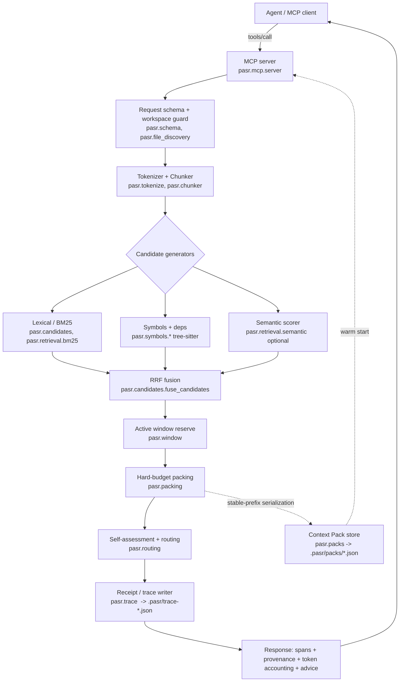

# PASR MCP — Architecture

PASR (Provenance-Aware Span Recall) is a **zero-setup context-broker MCP** for coding
and document agents. It sits between a large workspace (repo or long documents) and the
model, and hands the agent a **small, budgeted, fully-traceable slice** of that
workspace instead of letting the agent read whole files.

It is a productised extraction of the `researchv2` study (model-external context
optimisation). That research is frozen; this repository is its product line.

## What it is / is not

| It is | It is not |
|---|---|
| A local program an agent calls as an MCP tool | A model, an IDE, or a chatbot |
| A retrieval + token-budget + audit layer | A "solve long-context / lost-in-the-middle" claim |
| Deterministic, inspectable, offline by default | A hosted service or vector-DB signup |
| Good at *locating* evidence and *tracing* dependencies | A repo-wide code-completion engine (research showed quality loss there) |

## Honest capability boundary (from the research)

- **Strong:** deterministic dependency / variable-trace closure (~99% fewer tokens,
  quality preserved or improved on RULER-style tasks).
- **Positive, bounded:** localized document/code QA — ~30–50% fewer model input tokens
  and lower latency at parity quality on LongBench-Pro-style tasks.
- **Weak / do not claim:** global aggregation (BABILong), repo-wide code completion
  (RepoBench), lexical-mismatch position robustness (NoLiMa).

Positioning follows the boundary: **"help the agent find the right place and follow the
right chain,"** not "write the code for you."

## Target component architecture


```mermaid
flowchart TD
    A[Agent / MCP client] -->|tools/call| S[MCP server<br/>pasr.mcp.server]
    S --> R[Request schema + workspace guard<br/>pasr.schema, pasr.file_discovery]
    R --> T[Tokenizer + Chunker<br/>pasr.tokenize, pasr.chunker]
    T --> CG{Candidate generators}
    CG --> L[Lexical / BM25<br/>pasr.candidates, pasr.retrieval.bm25]
    CG --> SY[Symbols + deps<br/>pasr.symbols.* tree-sitter]
    CG --> SE[Semantic scorer<br/>pasr.retrieval.semantic  optional]
    L --> F[RRF fusion<br/>pasr.candidates.fuse_candidates]
    SY --> F
    SE --> F
    F --> AW[Active window reserve<br/>pasr.window]
    AW --> P[Hard-budget packing<br/>pasr.packing]
    P --> SA[Self-assessment + routing<br/>pasr.routing]
    SA --> RC[Receipt / trace writer<br/>pasr.trace  -> .pasr/trace-*.json]
    RC --> O[Response: spans + provenance + token accounting + advice]
    O --> A
    P -.stable-prefix serialization.-> PK[Context Pack store<br/>pasr.packs -> .pasr/packs/*.json]
    PK -.warm start.-> S
```

## Data flow (one `select_context` call)

```text
query + file globs
  -> resolve safe workspace files              (file_discovery)
  -> tokenize + line-aligned chunking          (tokenize, chunker)  -> RawSpan[]
  -> LOSSLESS-UNDER-BUDGET check: full context fits budget? return it unchanged
  -> candidate generation (lexical/BM25 + symbols + optional semantic)
  -> RRF fusion -> single ranked CandidateSpan[]
  -> reserve active window (prefix + tail)
  -> hard-budget whole-span packing (score-only | coverage-aware)
  -> self-assessment: confidence + query-class (localized | trace | aggregation)
  -> write receipt (.pasr/trace-<id>.json) + human-readable summary
  -> return { spans[], provenance(file:line), token_accounting, routing_advice }
```

## Core modules

| Module | Responsibility |
|---|---|
| `tokenize.py`, `chunker.py` | `Tokenizer` protocol + line-aligned chunking → `RawSpan[]` |
| `file_discovery.py` | safe workspace-relative discovery, `.gitignore`-aware |
| `evidence.py` | keyword extraction, claim / coverage accounting |
| `retrieval/bm25.py`, `retrieval/lexical.py` | Okapi BM25 + lexical-anchor coverage |
| `symbols/` | tree-sitter symbol + dependency candidates (Python, JS/TS) |
| `retrieval/semantic.py` | optional sub-word or MiniLM cosine scorer |
| `candidates.py` | `CandidateSpan` type, reciprocal-rank fusion, stable ranking |
| `window.py`, `packing.py` | active-window reserve + hard-budget packing, dependency ordering |
| `routing.py` | query classification + confidence + advice |
| `select.py`, `trace.py` | the `select_context` / `trace_dependencies` pipelines |
| `receipt.py`, `packs.py`, `ledger.py` | byte-stable receipts, Context Packs, the usage ledger |
| `mcp/server.py`, `cli.py` | the MCP stdio server and the `pasr` CLI |

`controller.py` (heuristic block-size / top-k choice) is carried but **not wired into
`select_context`** — fixed `schema` defaults + `routing.py` cover the shipped design; it
stays as a utility for adaptive-settings callers.

## MCP tools

| Tool | Purpose |
|---|---|
| `find_evidence` | workspace content search: term rarity blended with sub-word similarity and reference rank; matching lines and bounded `read_lines` spans on the top hits, never bodies |
| `find_files` | path/filename ranking |
| `find_symbols` | definition index (`file:line kind name`) |
| `find_usages` | one-hop reference index; each hit has its line and enclosing definition, the top hits a bounded `read_lines` |
| `select_context` | budgeted, traceable slice for a query (+ `outline`, `path:start-end` reads, `map_tokens`, `trace=`, Context Packs) |
| `trace_dependencies` | deterministic def/reference closure for a symbol; `direction="callers"` reverses it |
| `expand_context` | increase the budget while retaining the prior source ranges and outline mode |
| `explain_selection` | return the receipt for a prior selection id |

The active window -- a mandatory head and tail carved out of the budget -- applies to a
single source only. It keeps a document's imports and setup at one end and its most recent
material at the other; a set of files has neither, and across several sources it reserved
the opening lines of whichever file sorted first and the closing lines of whichever sorted
last. Scoped to a directory at an 800-token budget that spent 646 tokens on two files the
query never mentioned. On the 50-task selection suite, restricting it to one source raises
critical-source hits from 11 to 18 at an 800-token budget and from 20 to 26 at 1,500; at
the suite's own 6,000-token default the window is 8% of the budget and the defect is
invisible, which is why it went unnoticed.

Ranged selection operates on merged, inclusive source sections before chunking and
tokenization. Original line/character provenance is preserved; token coordinates
cover only selected sections. Whole-file symbol candidates cannot reintroduce
excluded text. Maps/outlines retain only complete in-range definitions, and embedded
traces parse source with excluded lines removed from consideration. Receipts store
the original range selectors so expansion cannot silently widen the read.
Routing advice distinguishes complete requested sections from whole-file or
caller/dependency coverage. A lossless ranged read does not need query refinement
or more budget for the same scope; additional relationships require new source reads.

Content search ranks files by the inverse document frequency of the query terms they
contain, discounted by file length the way BM25 discounts a document: a term counts as
present if it appears anywhere, so a 4,784-line file was far likelier to hold all of a
question's words somewhere than the 306-line file that answered it, and scored as though
that were the same evidence. It then rescores the top 250 of that ranking by sub-word similarity -- shared
character n-grams rather than whole words, so morphology and near-synonyms survive -- and
blends them with a third: personalised PageRank over the graph of "this file names
something that file defines", started from the lexical scores. That is how Aider ranks a
repository, and it is the signal the other two cannot see -- a file can be the answer while
saying none of the question's words, as long as the files that do say them lean on it.
`gc.rs` defines `PluginGc`, and `persistent.rs`, which the words do reach, calls it. All
three are scaled by their own maximum. Rarity is what the tool is for and the
blend preserves the margin a rare term earns: similarity can promote a file a long way but
cannot by itself overturn a decisive rarity win. Both added weights are 1.0. On the fourteen queries two models actually issued against
nushell, the ground-truth file moved inside the window the model asked for in 10 of 14
rather than 6, the median hit rank from 31 to 5 and the worst from 164 to 38. Similarity at
1.5 reached 12 of 14 and broke the rarity guarantee, so it stays at 1.0; the graph weight
measured the same anywhere between 0.5 and 2.0 and never threatened that guarantee, since a
file nothing references gains nothing. Neither scorer is a model: no download, nothing to
install.

Re-ranking can only reorder files that already matched a term. A file sharing no word with
the query is not a candidate, and none of this reaches it.

Term matching reads every file every time. Everything else in the ranking is a property of
the file rather than the query, and lives in `.pasr/index.sqlite3`: each file's block
features and the symbols it defines, keyed on its size and mtime. On a 2,478-file, 429k-line
repository the store is 8MB, and three searches in a fresh process take 6.2s against 21.6s
without it -- the case that matters, since an agent starts a new session per task. Only the
heaviest 256 features of a block are kept, which measured identically on every recorded
query and is applied whether or not an index exists: an indexed search and an unindexed one
return the same bytes. A missing, stale, corrupt, read-only or locked index costs speed and
changes no result, and any change to the block size, the trim or the scorer discards the
store rather than reading it back under new rules.

A hit carries its provenance, the matched line and its enclosing definition, and nothing
that repeats them. It used to also carry the terms it matched -- visible in the line -- and
a score, which restated its position and, on a blended rank, was not interpretable anyway.
The two were a fifth of the payload of a search result, and a search result is re-sent to
the model on every later turn. A thirty-hit result costs about 1,500 tokens against a
grep's 700 for the same lines; the difference is the enclosing definition, which grep
cannot give, and JSON structure. Grouping hits under their file would save a further 8%
and change the shape every caller and every piece of advice depends on, which is not a
trade worth making.

A session's stopping rule counts delivered **lines**, not provenance strings. `f:1-95` and
`f:1-100` are different strings and almost the same evidence, so counting strings called the
re-read wholly new -- which is the loop the rule exists to catch. Two consecutive selections
that are less than a quarter new are refused, and the refusal names what the caller already
holds. From the second file onward every selection also carries that figure, whether or not
anything is wrong: across every recorded trajectory, in PASR and grep/read arms alike, about
half the calls happened after the evidence was in hand, and nothing in the loop ever said so.

Locator `read_lines` values preserve a complete enclosing function up to 40 lines,
otherwise a neighborhood of up to eight lines before and after the hit. This is
navigation guidance, not a body truncation policy: original hit text and ranking
remain unchanged, and callers can request larger ranges or complete definitions.
Only the leading hits carry the span, and it omits the path the hit already reports:
a search result is re-sent on every later turn, so a hint repeated across thirty hits
cost more than the narrower reads it enabled saved.

## Design rules

1. Every candidate generator returns the same `CandidateSpan` record type.
2. Ranking and packing are separate operations.
3. The reader only ever sees **copied raw source text** — never scores, vectors, or
   generated summaries.
4. Token budget is a **hard contract**: the tool never returns more than `budget_tokens`.
5. **Lossless under budget:** if the full serialized context already fits the budget,
   return it unchanged and say so.
6. Deterministic: same repo + same query + same config => identical bytes out.
7. Offline by default: no network, no daemon, no vector DB. External services are
   strictly opt-in (`SemanticScorer` plugins).
8. Every response carries file+line provenance, token count, selection reason, and
   score components for every span, plus a routing self-assessment.
9. Each stage is independently testable and can be disabled for ablation.
